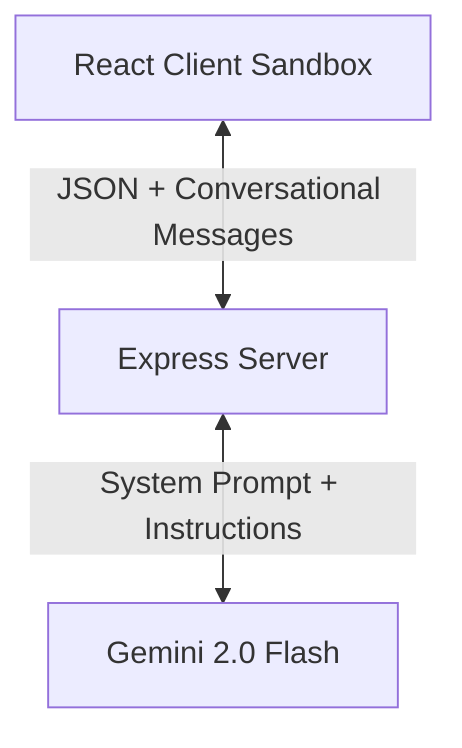

# Compra AI Layout Agent: Architectural & Implementation Approach

This document outlines the architectural patterns, logic, and engineering decisions implemented to build the AI Layout Agent proof of concept.

---

## 🧭 Core Architecture Overview

The system is architected as a decoupled client-server application:

### 1. The Design Schema Concept
The design schema separates absolute sizing coordinates from normalized coordinate ratios:
*   **Absolute coordinates (`x`, `y`, `width`, `height`)** are utilized by the wireframe canvas renderer and layer tree panel to visually display components.
*   **Normalized ratios (`nx`, `ny`, `nw`, `nh`)** represent coordinate factors relative to the parent artboard's current width and height. E.g., `nx = x / artboard_width`.
This distinction is vital for aspect ratio changes (such as 9:16 layout conversion).

---

## 🧠 LLM Integration Strategy

Rather than writing custom regex parsing libraries or manual rule engines (which are fragile and scale poorly), we delegated the layout reasoning to **Gemini 2.0 Flash**.

### 1. Robust System Prompt Engineering
The system prompt establishes the following constraints:
*   **Semantic Roles Understanding**: Instructs the agent on what each element represents (e.g. background image is a canvas backdrop, circle + overlay texts represent a yellow discount badge, vector stars represent a rating system, and the sofa graphic is the main product).
*   **Mathematical Synchronization**: Strict guidelines enforcing that whenever absolute dimensions are changed, the normalized ratio values must be recalculated to remain consistent.
*   **Spatial Vocabulary**: Clear rules mapping natural language keys to geometric operations:
    *   *"Move higher" / "Move to the top"* ➔ Decrease `y` values.
    *   *"Move lower" / "Move to the bottom"* ➔ Increase `y` values.
    *   *"Keep product large"* ➔ Preserve or scale the dimensions of the sofa graphic (`img_1778489515746_17`) relative to the artboard.
*   **Strict JSON Output**: Restricts the model to returning *only* valid JSON.

### 2. Conversational Context Continuity
For follow-up support (e.g. user says: *"Move the headline to the top"*, then *"Make it smaller"*), the application preserves history by sending past conversations as structural roles (`user` and `model`) back to the Gemini session. This lets the agent easily resolve references like "it" to the correct node target.

---

## 🎨 Frontend Visual Sandbox

The frontend was engineered to offer a high-fidelity visual experience:
1.  **Wireframe Preview**: Live SVG/CSS canvas rendering elements from the nodes dictionary. Text colors, sizing ratios, fonts, shapes (circles), backgrounds, rating stars, and products dynamically scale to fit preview constraints.
2.  **Layer Tree**: Shows real-time alignment, coordinate bounds, layer hierarchy, and types (artboard vs image vs text vs shape).
3.  **Highlighted JSON Inspector**: Instantly displays the new layout state after modifications with rich theme token syntax styling.

---

## ⚡ Differential Change Detection

To make the AI agent feel alive and responsive, the Express server performs a **differential coordinate delta check** between the original and modified JSON nodes. 
If an element is moved, resized, or restyled, the backend logs a friendly message, such as:
*   *Moved "Luxury Comfort" from (133, 175) to (133, 50)*
*   *Changed "Instagram Post" dimensions to 1080×1920*

This is displayed directly inside the chat bubbles as clear visual success indicators!

---

## 🛠️ Advanced Architectural Features

### 1. Robust Multi-Model Fallback Chain
To ensure 100% operational uptime and bypass strict Google API rate limits or quota caps on the free tier (like the common `429 Too Many Requests` on `gemini-2.0-flash` free-tier), the Express server implements an automated model resilience chain.
* If a model call fails, the server automatically traverses a list of alternative endpoints in real time: `gemini-3-flash-preview` ➔ `gemini-2.5-flash` ➔ `gemini-flash-latest` ➔ `gemini-2.0-flash`.
* This fallback is transparent to the user and guarantees instantaneous response delivery under heavy load.

### 2. Figma-Style Design Studio & Interactive Inspector
Rather than a static mockup visualizer, the client workspace was transformed into a premium design studio dashboard:
* **Interactive Canvas Selectors**: Hovering or clicking elements inside the graphic preview canvas highlights them with a Figma-style dashed boundary border and corner resize handles.
* **Dual Rendering Modes**: 
  * *Mockup Mode*: Renders full assets, styling, and color overlays for high-fidelity representation.
  * *Blueprint Mode*: Translates layers into an architect's blueprint style using transparent containers, intersecting wireframe diagonal guides (`X`), and typography size indicators.
* **Live Properties Inspector (Specs Panel)**: Selecting any node enables manual parameter overrides (coordinates, text content, font sizes, style values, background fills) which automatically recalculate normalized ratios in real time.
* **Revision Timeline**: Logs a session audit log tracking every user prompt and its structural changes.

### 3. Custom SVG Brand Logo & Favicon
Designed a custom vector SVG brand identity for **Compra AI Layout Studio** representing the synthesis of layout bounding frames with an AI spark. The asset is linked directly as an SVG favicon in the browser tab and rendered natively in the top navigation bar.

### 4. Unified Production Build (Zero-CORS Architecture)
To eliminate CORS configuration issues in cloud deployments and minimize hosting costs:
* In production, the Express server acts as a unified static web host, serving the pre-compiled Vite React build directly from the `/dist` directory.
* SPA client-side routes fallback automatically to `index.html`.
* The client API endpoints dynamically switch to relative paths when running in production, resulting in a single deployment target suitable for 1-click cloud launching on platforms like Render or Railway.
